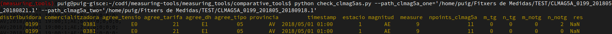

# measuring-tools
Tools to prepare and test energy measurements

- Provides console applications to execute actions on measures
  - Merge tools
  - Statistics tools
  - Comparative tools
  
### How to install:
```bash
pip install -e .
```
### How to use:
- Get help:
  - `$ python measuring-tools/measuring_tools/comparative_tools/check_measures.py --help`
- Ex1:
  - `$ cd measuring-tools/measuring_tools/`
  - `$ python comparative_tools/check_measures.py --path_clinmes='/path_to_files/' --path_clmag5a='/path_to_clmag5a/filename' --write_csv=True`
- Ex2:
  - `$ cd measuring-tools/measuring_tools/`
  - `$ python merge_tools/merge_clinmes.py --path_clinmes_one='/path_to_files/' --path_clinmes_two='/path_to_files/' --path_dest='/path_dest/'`

Feel like this: 


- Profiler example:
  - `$ python profile_process.py -s http://localhost:18069 -u admin -d database_name -p passowrd --di 2018-09-01 --df 2018-12-31 --server_type comer --anuladores True`
